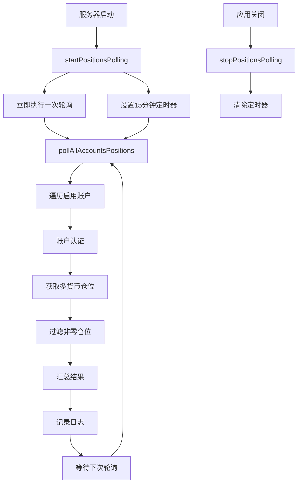

# 期权仓位轮询系统

## 概述

实现了一个每15分钟自动轮询所有启用账户期权仓位的系统，支持自动启动和手动控制，为后续的仓位管理和风险控制提供数据基础。

## 控制方式

### 🔄 混合控制模式
系统采用**默认启动 + API控制**的混合方式：

1. **自动启动**: 服务器启动时默认开始轮询
2. **环境变量控制**: 可通过 `AUTO_START_POLLING=false` 禁用自动启动
3. **API控制**: 提供完整的启动/停止/状态查询接口
4. **优雅关闭**: 应用关闭时自动停止轮询

### 🎛️ 控制选项

#### 环境变量
```bash
# 禁用自动启动（默认为 true）
AUTO_START_POLLING=false

# 其他相关环境变量
USE_TEST_ENVIRONMENT=true
```

#### API 控制
```http
# 启动轮询
POST /api/positions/start-polling

# 停止轮询
POST /api/positions/stop-polling

# 查看状态
GET /api/positions/polling-status

# 手动触发一次
POST /api/positions/poll
```

## 概述

实现了一个每15分钟自动轮询所有启用账户期权仓位的系统，为后续的仓位管理和风险控制提供数据基础。

## 功能特性

### 🔄 自动轮询
- **轮询频率**: 每15分钟执行一次
- **启动时机**: 服务器启动后立即开始
- **覆盖范围**: 所有启用的账户
- **支持货币**: BTC, ETH, SOL 期权

### 📊 数据收集
- **仓位信息**: 获取所有非零仓位
- **多货币支持**: 同时获取多个货币的期权仓位
- **实时数据**: 直接从 Deribit API 获取最新数据
- **Mock模式**: 支持模拟数据用于测试

### 🛡️ 错误处理
- **账户级容错**: 单个账户失败不影响其他账户
- **货币级容错**: 单个货币失败不影响其他货币
- **优雅降级**: API失败时自动回退到Mock数据
- **详细日志**: 完整的执行日志和错误追踪

## 实现位置

### 📁 文件位置
```
src/index.ts
```

### 🏗️ 架构设计
轮询功能直接在主应用入口 `src/index.ts` 中实现，原因：

1. **生命周期管理**: 与服务器启动/关闭绑定
2. **资源共享**: 复用现有的服务实例
3. **统一管理**: 集中管理所有定时任务
4. **简单可靠**: 避免额外的复杂性

## API 接口

### 1. 手动触发轮询
```http
POST /api/positions/poll
```

**响应示例**:
```json
{
  "success": true,
  "message": "Positions polling completed successfully",
  "data": [
    {
      "accountName": "account_1",
      "success": true,
      "mockMode": false,
      "data": [
        {
          "currency": "BTC",
          "positions": [
            {
              "instrument_name": "BTC-8AUG25-113000-C",
              "size": 10.5,
              "direction": "buy",
              "average_price": 0.025,
              "mark_price": 0.028,
              "unrealized_pnl": 0.315,
              "delta": 0.65
            }
          ]
        }
      ],
      "timestamp": "2025-07-30T14:30:00.000Z"
    }
  ],
  "timestamp": "2025-07-30T14:30:00.000Z"
}
```

### 2. 获取轮询状态
```http
GET /api/positions/polling-status
```

**响应示例**:
```json
{
  "success": true,
  "data": {
    "isActive": true,
    "intervalMinutes": 15,
    "nextPollEstimate": "2025-07-30T14:45:00.000Z",
    "enabledAccounts": ["account_1", "account_2"]
  },
  "timestamp": "2025-07-30T14:30:00.000Z"
}
```

### 3. 启动轮询
```http
POST /api/positions/start-polling
```

**成功响应**:
```json
{
  "success": true,
  "message": "Positions polling started successfully",
  "data": {
    "isActive": true,
    "intervalMinutes": 15,
    "nextPollEstimate": "2025-07-30T14:45:00.000Z"
  },
  "timestamp": "2025-07-30T14:30:00.000Z"
}
```

**已启动时的响应**:
```json
{
  "success": false,
  "message": "Polling is already active",
  "data": {
    "isActive": true,
    "intervalMinutes": 15
  },
  "timestamp": "2025-07-30T14:30:00.000Z"
}
```

### 4. 停止轮询
```http
POST /api/positions/stop-polling
```

**成功响应**:
```json
{
  "success": true,
  "message": "Positions polling stopped successfully",
  "data": {
    "isActive": false,
    "intervalMinutes": 15
  },
  "timestamp": "2025-07-30T14:30:00.000Z"
}
```

**已停止时的响应**:
```json
{
  "success": false,
  "message": "Polling is not active",
  "data": {
    "isActive": false
  },
  "timestamp": "2025-07-30T14:30:00.000Z"
}
```

## 核心函数

### `pollAllAccountsPositions()`
主要的轮询函数，负责：

1. **遍历所有启用账户**
2. **认证和API调用**
3. **数据收集和过滤**
4. **错误处理和日志**
5. **结果汇总**

### `startPositionsPolling()`
启动定时轮询：
- 立即执行一次轮询
- 设置15分钟间隔的定时器
- 错误处理和日志记录

### `stopPositionsPolling()`
停止轮询：
- 清除定时器
- 优雅关闭处理
- 在应用关闭时自动调用

## 数据流程



## 日志示例

### 正常轮询日志
```
🔄 [poll_1753883411071_abc123def] Starting positions polling for all enabled accounts
📊 [poll_1753883411071_abc123def] Polling account: account_1
📈 [poll_1753883411071_abc123def] account_1 - BTC: 3 active positions
📈 [poll_1753883411071_abc123def] account_1 - ETH: 2 active positions
📈 [poll_1753883411071_abc123def] account_1 - SOL: 1 active positions
✅ [poll_1753883411071_abc123def] Real data fetched for account_1: 3 currencies with positions
📊 [poll_1753883411071_abc123def] Polling completed: 1/1 accounts successful, 6 total positions
```

### 错误处理日志
```
❌ [poll_1753883411071_abc123def] Failed to poll account account_2: Authentication failed
⚠️ [poll_1753883411071_abc123def] Failed to get SOL positions for account_1: Network timeout
📊 [poll_1753883411071_abc123def] Polling completed: 1/2 accounts successful, 4 total positions
```

## 配置选项

### 环境变量
- `USE_TEST_ENVIRONMENT`: 是否使用测试环境
- `API_KEY_FILE`: API密钥配置文件路径

### 轮询参数
```typescript
const POLLING_INTERVAL = 15 * 60 * 1000; // 15分钟
const currencies = ['BTC', 'ETH', 'SOL']; // 支持的货币
```

## 扩展功能

### 🔮 后续可添加的功能

1. **数据存储**
   ```typescript
   // 将轮询结果存储到数据库
   await positionManager.savePositions(results);
   ```

2. **风险监控**
   ```typescript
   // 计算总体风险指标
   const riskMetrics = calculateRiskMetrics(results);
   if (riskMetrics.totalDelta > threshold) {
     await sendRiskAlert(riskMetrics);
   }
   ```

3. **自动调仓**
   ```typescript
   // 根据预设规则自动调整仓位
   const adjustments = calculatePositionAdjustments(results);
   await executeAdjustments(adjustments);
   ```

4. **通知系统**
   ```typescript
   // 发送仓位报告
   await sendPositionReport(results);
   ```

## 性能考虑

### 📈 优化措施
- **并行请求**: 同时获取多个货币的数据
- **错误隔离**: 单个失败不影响整体
- **数据过滤**: 只处理非零仓位
- **内存管理**: 及时清理临时数据

### 📊 监控指标
- 轮询成功率
- 平均执行时间
- API调用次数
- 错误频率

## 使用建议

### ✅ 最佳实践
1. **监控日志**: 定期检查轮询日志
2. **测试模式**: 先在Mock模式下验证
3. **错误处理**: 关注失败的账户和原因
4. **性能监控**: 观察执行时间和资源使用

### ⚠️ 注意事项
1. **API限制**: 注意Deribit API的调用频率限制
2. **网络稳定**: 确保网络连接稳定
3. **认证有效**: 定期检查API密钥有效性
4. **资源使用**: 监控内存和CPU使用情况

## 总结

期权仓位轮询系统为整个交易系统提供了稳定的数据基础，支持：

- ✅ **自动化**: 无需人工干预的定时轮询
- ✅ **可靠性**: 完善的错误处理和容错机制
- ✅ **可扩展**: 易于添加新功能和优化
- ✅ **可监控**: 详细的日志和状态接口
- ✅ **可控制**: 支持手动触发和状态查询

这为后续的仓位管理、风险控制和自动化交易奠定了坚实的基础。
